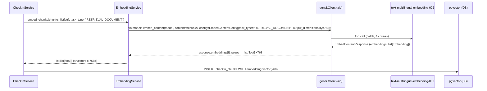
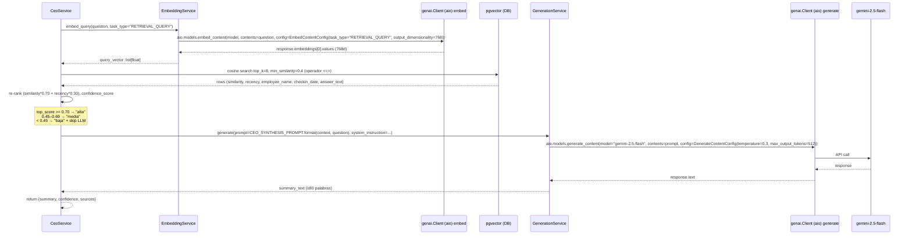

# Vertex AI / google-genai Integration Plan
## EPIC-001: Migración del Núcleo RAG a Gemini

**Generado:** 2026-05-16
**Scope:** Solo migración de capas de embeddings y generación. No incluye endpoints de check-in ni CEO (esos son epics futuras).

---

## 1. Dependency & SDK

### Package

```
google-genai>=2.3.0
```

- **NO usar** `google-generativeai` — está deprecado y su API es completamente diferente.
- Eliminar de `pyproject.toml`: `openai>=1.0`, `tiktoken>=0.7`.

### Imports canónicos

```python
from google import genai
from google.genai import types
```

### Inicialización del cliente

El cliente se instancia **una sola vez** en `__init__` de cada service class (singleton por instancia). No instanciar en cada llamada.

```python
self._client = genai.Client(api_key=settings.GEMINI_API_KEY)
```

Para llamadas async usar siempre `self._client.aio.models.*` (no `self._client.models.*` que es síncrono).

---

## 2. Variables de entorno — app/config.py

### Cambios requeridos

Eliminar:
```
OPENAI_API_KEY
EMBEDDING_MODEL = "text-embedding-3-small"
EMBEDDING_DIMENSIONS = 1536
LLM_MODEL = "o4-mini"
LLM_MAX_OUTPUT_TOKENS = 16384
LLM_TIMEOUT = 120
```

Añadir:
```
GEMINI_API_KEY: str = ""
EMBEDDING_MODEL: str = "text-multilingual-embedding-002"
EMBEDDING_DIMENSIONS: int = 768
LLM_MODEL: str = "gemini-2.5-flash"
LLM_MAX_OUTPUT_TOKENS: int = 8192
```

Nota: `LLM_TIMEOUT` desaparece porque el SDK `google-genai` no acepta un parámetro de timeout global en el constructor del Client de la misma forma que OpenAI. El timeout se puede controlar a nivel HTTP si se necesita en el futuro vía `httpOptions` en `GenerateContentConfig`.

El validador `embedding_dimensions_must_be_positive` en `app/config.py` se mantiene sin cambios.

---

## 3. Embeddings — app/core/embeddings.py

### Modelo

`text-multilingual-embedding-002` — 768 dimensiones, multilingüe (soporta español nativo).

**IMPORTANTE:** Las dimensiones son 768, NO 1536. 1536 era OpenAI `text-embedding-3-small`.

### Llamada exacta (async)

```python
response = await self._client.aio.models.embed_content(
    model="text-multilingual-embedding-002",
    contents=text,                          # str para single, list[str] para batch
    config=types.EmbedContentConfig(
        task_type=task_type,                # "RETRIEVAL_DOCUMENT" o "RETRIEVAL_QUERY"
        output_dimensionality=768,
    ),
)
```

Acceso al vector:
```python
# single
vector = response.embeddings[0].values   # list[float], len == 768

# batch
vectors = [emb.values for emb in response.embeddings]
```

### Regla de task_type

| Caso de uso | task_type |
|---|---|
| Indexar chunks al completar un check-in | `"RETRIEVAL_DOCUMENT"` |
| Embeddear query del CEO para búsqueda | `"RETRIEVAL_QUERY"` |
| Búsqueda semántica genérica (RAG actual) | `"RETRIEVAL_QUERY"` |

### Formato del chunk text a embeddear (futuro check-in)

```
Empleado: {employee_name}
Fecha: {checkin_date}
Pregunta: {question_text}
Respuesta: {answer_text}
```

Para el RAG actual de estimaciones, el texto a embeddear es el `content_text` del chunk existente, sin cambios de formato.

### Batch embedding

`contents` acepta `list[str]` directamente. La respuesta devuelve `response.embeddings` como lista en el mismo orden:

```python
response = await self._client.aio.models.embed_content(
    model="text-multilingual-embedding-002",
    contents=["texto 1", "texto 2", "texto 3"],
    config=types.EmbedContentConfig(
        task_type="RETRIEVAL_DOCUMENT",
        output_dimensionality=768,
    ),
)
vectors = [emb.values for emb in response.embeddings]
# len(vectors) == 3, len(vectors[0]) == 768
```

### Validación post-embedding

Mantener la validación de dimensiones y null-vector del código OpenAI actual, adaptada a 768:

```python
for i, emb in enumerate(response.embeddings):
    if len(emb.values) != 768:
        raise EmbeddingError(f"Embedding {i} tiene {len(emb.values)} dims, esperado 768")
    if all(v == 0.0 for v in emb.values):
        raise EmbeddingError(f"Embedding {i} es vector nulo")
```

### Firma pública de EmbeddingService (sin cambios de interfaz)

Los métodos públicos mantienen la misma firma que el código OpenAI actual para no romper `retrieval.py`:

```python
async def generate_embeddings(self, texts: list[str]) -> list[list[float]]
async def generate_single_embedding(self, text: str) -> list[float]
```

Eliminar: `_truncate_to_token_limit` y la dependencia de `tiktoken`. El modelo `text-multilingual-embedding-002` acepta hasta ~2048 tokens. Si se requiere truncado en el futuro, implementar por caracteres (~8000 chars ≈ 2000 tokens), sin tiktoken.

### Inicialización de EmbeddingService

```python
def __init__(self, api_key: str, model: str, dimensions: int) -> None:
    self._client = genai.Client(api_key=api_key)
    self._model = model          # "text-multilingual-embedding-002"
    self._dimensions = dimensions  # 768
```

Se mantiene la misma firma de `__init__` para no romper el punto de inyección de dependencias en `app/main.py` o el factory que cree el servicio.

---

## 4. Generación — app/core/generation.py

### Modelo

`gemini-2.5-flash`

### Llamada exacta (async)

```python
response = await self._client.aio.models.generate_content(
    model="gemini-2.5-flash",
    contents=prompt,
    config=types.GenerateContentConfig(
        max_output_tokens=self._max_output_tokens,
        temperature=self._temperature,
        system_instruction=system_instruction,  # None si no aplica
    ),
)
return response.text
```

`response.text` devuelve el texto generado como `str`. Si la respuesta está vacía o bloqueada, `response.text` puede ser `None` — validar y lanzar `GenerationError`.

### Parámetros por caso de uso

| Caso de uso | temperature | max_output_tokens |
|---|---|---|
| CEO summary / respuesta factual | 0.3 | 512 |
| Check-in conversacional (futuro) | 0.7 | 512 |
| Uso general en esta epic | 0.3 | 8192 (configurable desde settings) |

### Inicialización de GenerationService

```python
def __init__(
    self,
    api_key: str,
    model: str,
    max_output_tokens: int = 8192,
    temperature: float = 0.3,
) -> None:
    self._client = genai.Client(api_key=api_key)
    self._model = model
    self._max_output_tokens = max_output_tokens
    self._temperature = temperature
```

El parámetro `timeout` se elimina (no tiene equivalente directo en el constructor de `genai.Client`).

### Método público simplificado

En esta epic, `GenerationService` expone un método genérico `generate()`. Los métodos legacy `generate_estimation()`, `validate_estimation()`, `build_fallback_estimation()`, `_call_llm_with_retries()` y `_call_llm()` se eliminan junto con los módulos legacy que los usan.

```python
async def generate(
    self,
    prompt: str,
    system_instruction: str | None = None,
) -> str:
    """Genera texto con Gemini 2.5 Flash. Incluye retry logic interno."""
    ...
```

---

## 5. Retry Strategy — app/core/generation.py y app/core/embeddings.py

### Errores a capturar

```python
from google.api_core import exceptions as google_exceptions

google_exceptions.ResourceExhausted    # 429 quota
google_exceptions.DeadlineExceeded     # timeout
google_exceptions.ServiceUnavailable   # 503 server down
```

**NO capturar** `google.api_core.exceptions.InvalidArgument` ni `PermissionDenied` — esos son bugs de configuración, no errores transitorios.

### Backoff por tipo de error

| Error | Max intentos | Delays (segundos) |
|---|---|---|
| `ResourceExhausted` (quota) | 4 | 2 → 4 → 8 → 16 |
| `DeadlineExceeded` (timeout) | 2 | 4 → 8 |
| `ServiceUnavailable` (5xx) | 2 | 2 → 4 |

### Patrón de implementación

```python
import asyncio
from google.api_core import exceptions as google_exceptions

async def _call_with_retries(self, *args, **kwargs) -> str:
    delays_by_error = {
        google_exceptions.ResourceExhausted: [2, 4, 8, 16],
        google_exceptions.DeadlineExceeded: [4, 8],
        google_exceptions.ServiceUnavailable: [2, 4],
    }
    last_exc = None
    for error_type, delays in delays_by_error.items():
        # Reset on each error type pass — use a flat retry wrapper instead
        pass

    # Preferred: flat retry loop with error-type dispatch
    for attempt in range(4):  # máx 4 intentos totales
        try:
            return await self._call_once(*args, **kwargs)
        except google_exceptions.ResourceExhausted as e:
            delays = [2, 4, 8, 16]
            if attempt < len(delays):
                await asyncio.sleep(delays[attempt])
                last_exc = e
                continue
            raise GenerationError("Quota agotada tras reintentos") from e
        except google_exceptions.DeadlineExceeded as e:
            if attempt < 2:
                await asyncio.sleep([4, 8][attempt])
                last_exc = e
                continue
            raise GenerationError("Timeout tras reintentos") from e
        except google_exceptions.ServiceUnavailable as e:
            if attempt < 2:
                await asyncio.sleep([2, 4][attempt])
                last_exc = e
                continue
            raise GenerationError("Servicio no disponible") from e
    raise GenerationError("Error de generación tras reintentos") from last_exc
```

### Regla de exposición de errores

- **Nunca** pasar el mensaje raw de `google_exceptions.*` al usuario final.
- `GenerationError` y `EmbeddingError` usan mensajes genéricos en español.
- El error real se loguea con `structlog` incluyendo `exc_info=True` para stack trace en logs.

```python
except google_exceptions.ResourceExhausted as e:
    logger.warning("Gemini quota agotada", attempt=attempt, error=str(e))
    # NO: raise GenerationError(str(e))  ← expone mensaje raw
    # SÍ:
    raise GenerationError("Cuota de API agotada temporalmente") from e
```

---

## 6. Prompts — app/core/prompts.py

Este archivo **debe crearse en esta epic** aunque los prompts de check-in y CEO sean para epics futuras. En EPIC-001 se crean las constantes necesarias para los casos de uso que sí están en scope: la generación genérica (si se mantiene algún endpoint de búsqueda/RAG).

### Constantes mínimas para EPIC-001

```python
# app/core/prompts.py

# Usado por GenerationService.generate() en contexto RAG de estimaciones
RAG_SYSTEM_INSTRUCTION = """
Eres un asistente de estimación de proyectos de software.
Responde en español. Sé conciso y directo.
Basa tu respuesta ÚNICAMENTE en el contexto proporcionado.
"""

# Plantilla de contexto para búsqueda RAG
RAG_CONTEXT_TEMPLATE = """
Basándote en los siguientes fragmentos de proyectos históricos, responde la consulta.

FRAGMENTOS:
{context}

CONSULTA: {query}
"""
```

Los prompts de CEO y check-in se añadirán en EPIC-002/003 pero el archivo `prompts.py` debe existir desde EPIC-001 para establecer el patrón.

### Regla de oro

**NUNCA** escribir prompts inline en `generation.py`, `retrieval.py` ni en ningún service. Siempre importar desde `app.core.prompts`.

---

## 7. Adaptaciones en app/core/retrieval.py

Solo dos cambios en scope de EPIC-001:

1. **Eliminar imports legacy**: `from app.core.query_preprocessing import preprocess_query` y el uso de `preprocessed.detected_technologies`, `preprocessed.suggested_chunk_types`. El campo `detected_technologies` en `SearchResponse` se puede mantener como lista vacía temporalmente.

2. **Eliminar filtros legacy de SQL**: Los filtros `chunk_types`, `technologies`, `min_cost`, `max_cost` en el SQL dinámico se eliminan. La query queda limpia con solo el filtro de similarity mínima.

3. **Eliminar logging en `SearchLog`**: El modelo `SearchLog` está en la lista de archivos a eliminar — remover el bloque de logging en el step 8 de `search()`.

**No cambiar** el operador `<=>` (coseno pgvector) ni la estructura SQL base — eso es correcto y se mantiene. La dimensión del vector la gestiona la columna en la DB, no la query.

---

## 8. Adaptaciones en app/core/ranking.py

Un solo cambio de pesos en `calculate_final_score()`:

**Antes (OpenAI / legacy):**
```python
0.50 * similarity + 0.25 * tech_match + 0.15 * recency + 0.10 * cost_range
```

**Después (Gemini / simplificado):**
```python
0.70 * similarity + 0.30 * recency
```

Los parámetros `tech_match` y `cost_range` se eliminan de la firma porque los filtros de tecnología y costo desaparecen de `retrieval.py`.

Las funciones `recency_score()` y `deduplicate_results()` se mantienen sin cambios.
Las funciones `technology_match_score()` y `cost_range_score()` se eliminan.

---

## 9. UML Sequence Diagrams (flujo futuro — contexto)

Estos diagramas muestran cómo las capas migradas en EPIC-001 serán usadas en epics futuras. No son parte del scope de EPIC-001.

### Flujo de embedding en check-in (EPIC-002/003)



### Flujo de CEO query (EPIC-004/005)



---

## 10. Notas críticas de implementación

### Async: siempre usar client.aio

El SDK `google-genai` distingue entre:
- `client.models.embed_content(...)` — **síncrono**, bloquea el event loop. NO usar en FastAPI.
- `client.aio.models.embed_content(...)` — **asíncrono**, correcto para FastAPI/asyncio.

Igual para `generate_content`: usar `client.aio.models.generate_content(...)`.

### task_type es snake_case en el constructor de Python

```python
# CORRECTO
types.EmbedContentConfig(task_type="RETRIEVAL_DOCUMENT", output_dimensionality=768)

# INCORRECTO (aunque el campo Pydantic se llama taskType internamente)
types.EmbedContentConfig(taskType="RETRIEVAL_DOCUMENT")
```

### response.text puede ser None

Si el modelo devuelve una respuesta vacía o bloqueada por safety filters, `response.text` es `None`. Siempre validar:

```python
text = response.text
if not text:
    raise GenerationError("Respuesta vacía del modelo")
return text
```

### Dimensiones: 768, no 1536

El validador en `app/config.py` (`embedding_dimensions_must_be_positive`) se mantiene. Asegurarse de que el default cambia a `768` y que `tests/conftest.py` genera mock vectors de 768 dimensiones.

### No usar tiktoken

`tiktoken` era necesario para truncar textos antes de enviarlos a OpenAI. Con `text-multilingual-embedding-002` el límite es ~2048 tokens. Si se implementa truncado preventivo, hacerlo por longitud de caracteres (~8000 chars) sin dependencia externa.

### Entornos: dev vs producción

| Variable | Desarrollo | Producción |
|---|---|---|
| `GEMINI_API_KEY` | `.env` local | Secret Manager (GCP) |
| Backend del client | Gemini Developer API | Vertex AI (opcional, mismo SDK) |
| Cambio de backend | ninguno | `genai.Client(vertexai=True, project=..., location=...)` |

Para Vertex AI en producción, el constructor cambia pero el resto del código (llamadas a `aio.models.*`) es idéntico. Esto significa que el código de `EmbeddingService` y `GenerationService` no necesita cambios entre entornos si se usa inyección de dependencias para el client.

---

## 11. Archivos afectados por esta epic (resumen)

| Archivo | Acción | Notas clave |
|---|---|---|
| `app/config.py` | Editar | Reemplazar settings OpenAI por Gemini; EMBEDDING_DIMENSIONS=768 |
| `app/core/embeddings.py` | Reescribir | genai.Client, aio.models.embed_content, 768d, sin tiktoken |
| `app/core/generation.py` | Reescribir | genai.Client, aio.models.generate_content, eliminar métodos estimation legacy |
| `app/core/retrieval.py` | Adaptar | Eliminar query_preprocessing, filtros legacy, SearchLog |
| `app/core/ranking.py` | Adaptar | Nuevos pesos (0.70/0.30), eliminar tech_match y cost_range |
| `app/core/prompts.py` | Crear | Constantes mínimas RAG para esta epic; base para futuras |
| `pyproject.toml` | Editar | Drop openai/tiktoken, add google-genai>=2.3.0 |
| `tests/conftest.py` | Editar | Mocks con 768 dims, eliminar live_api fixture |

---

## 12. Checklist de validación pre-merge

- [ ] `EMBEDDING_DIMENSIONS = 768` en config (no 1536)
- [ ] `client.aio.models.*` en todos los métodos async (no `client.models.*`)
- [ ] `task_type="RETRIEVAL_DOCUMENT"` al indexar, `"RETRIEVAL_QUERY"` al buscar
- [ ] `response.text` validado contra `None` antes de retornar
- [ ] `response.embeddings[0].values` (no `.embedding`, no `.data[0].embedding`)
- [ ] Retry captura `ResourceExhausted`, `DeadlineExceeded`, `ServiceUnavailable` de `google.api_core.exceptions`
- [ ] Ningún prompt inline en service files — todos en `app/core/prompts.py`
- [ ] `tiktoken` eliminado de imports y de `pyproject.toml`
- [ ] Mock vectors en tests tienen longitud 768
- [ ] `GenerationError` / `EmbeddingError` nunca exponen mensaje raw de la API al caller
