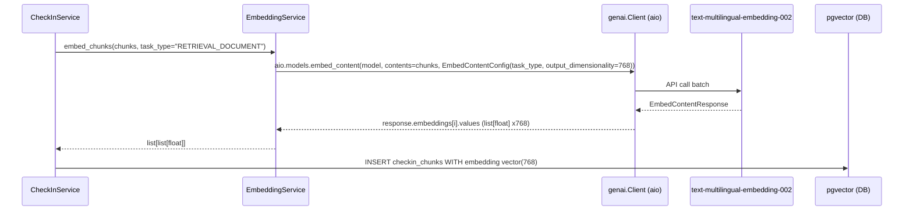
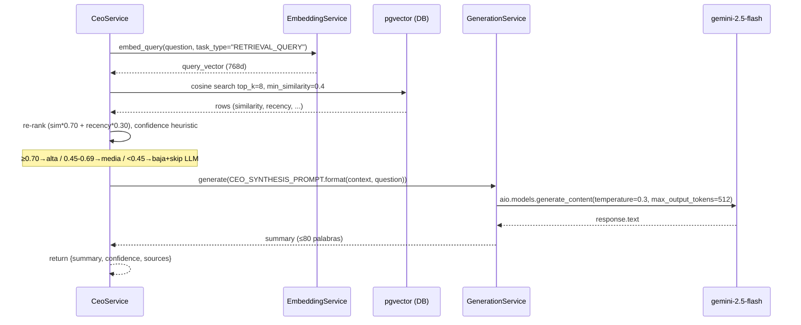

# EPIC-001: Migración del Núcleo RAG a Gemini

**Status:** open
**Espera a:** EPIC-000

## Descripción
Sustituir todas las dependencias de OpenAI por el nuevo SDK `google-genai`. Adaptar configuración y ajustar la dimensión de los vectores de 1536 → 768. Limpiar el código de estimación que ya no se usa.

## Tareas
- RAG-01 — Actualizar `app/config.py`
- RAG-02 — Reescribir `app/core/embeddings.py` → google-genai
- RAG-03 — Reescribir `app/core/generation.py` → gemini-2.5-flash
- RAG-04 — Adaptar `app/core/retrieval.py` (vector 768d, sin filtros legacy)
- RAG-05 — Eliminar módulos legacy de estimación

## Paralelización interna

| Tarea | Paralelo con | Espera a |
|-------|-------------|---------|
| RAG-01 | — | — |
| RAG-02 | RAG-03, RAG-05 | RAG-01 |
| RAG-03 | RAG-02, RAG-05 | RAG-01 |
| RAG-04 | RAG-05 | RAG-02 |
| RAG-05 | RAG-02, RAG-03 | RAG-01 |

---

## Technical Spec

**Issue local:** `issues/EPIC-001-migracion-gemini.md`
**Fecha:** 2026-05-16
**Estado:** listo
**Agentes:** @backend-developer, @vertex-ai-architect, @backend-test-engineer, @qa-criteria-validator

---

### Executive Summary

Sustituir el proveedor de AI de OpenAI a Google Gemini reescribiendo `EmbeddingService` (768d, `text-multilingual-embedding-002`) y `GenerationService` (`gemini-2.5-flash`) con el SDK `google-genai>=2.3.0`, usando siempre el path async `client.aio.models.*`. En paralelo se eliminan 17 módulos de estimación legacy y se simplifican los pesos de re-ranking a `similarity×0.70 + recency×0.30`. El schema de base de datos no cambia en esta epic — la columna `embedding` de `rag.chunks` sigue siendo `Vector(1536)` hasta EPIC-002.

---

### Problem Statement

**EPIC-001 — Migración del Núcleo RAG a Gemini:**

Sustituir todas las dependencias de OpenAI por el nuevo SDK `google-genai`. Adaptar configuración y ajustar la dimensión de los vectores de 1536 → 768. Limpiar el código de estimación que ya no se usa.

**Estado actual del sistema:**

- `app/config.py`: 6 settings de OpenAI hardcodeadas: `OPENAI_API_KEY`, `EMBEDDING_MODEL=text-embedding-3-small`, `EMBEDDING_DIMENSIONS=1536`, `LLM_MODEL=o4-mini`, `LLM_MAX_OUTPUT_TOKENS=16384`, `LLM_TIMEOUT=120`
- `app/core/embeddings.py`: `EmbeddingService` inicializa `AsyncOpenAI` + `tiktoken`. Métodos: `generate_embeddings(texts: list[str])`, `generate_single_embedding(text: str)`. Valida 1536 dims.
- `app/core/generation.py`: `GenerationService` usa `AsyncOpenAI.responses.create()`. Retry logic con 3 niveles (RateLimitError→3 reintentos exp, APITimeoutError→1 reintento, 5xx→2 reintentos). Método principal: `generate_estimation()` y `_call_llm_with_retries()`.
- `app/core/retrieval.py`: SQL con operador `<=>` (coseno), dimensión 1536 implícita. Re-ranking con pesos: similarity=0.50, tech_match=0.25, recency=0.15, cost_range=0.10. Filtros legacy: chunk_type, technologies, costs.
- `app/core/ranking.py`: `recency_score()` y `deduplicate_results()` reutilizables. `calculate_final_score()` requiere cambio de pesos.
- 15 archivos legacy a eliminar en `app/core/`, `app/api/v1/`, `app/models/`.
- `pyproject.toml`: depende de `openai>=1.0` y `tiktoken>=0.7`.
- `tests/conftest.py`: `_make_mock_embedding_service()` retorna vectores de 1536 dims.

**Impacto:**

Bloquea el resto de epics (EPIC-002 a EPIC-006). Sin esta migración no se pueden crear los nuevos modelos con embeddings 768d ni usar Gemini 2.5 Flash para el flujo conversacional.

---

### Proposed Solution

**Overview:**

Reemplazar `AsyncOpenAI` + `tiktoken` por `genai.Client(api_key=...).aio.models.*` en los dos servicios de AI del core. Actualizar `config.py` con las nuevas variables de Gemini. Simplificar `retrieval.py` eliminando filtros legacy y actualizar `ranking.py` con los nuevos pesos. Borrar los 17 módulos de estimación que quedan huérfanos. Sin cambios de schema de BD — eso es EPIC-002.

**Arquitectura:**
- **API Layer:** `app/api/v1/router.py` — eliminar rutas legacy (estimate, ingest, stats, quote-generation). Mantener solo health y search (adaptado).
- **Domain/Core:** Reescribir `embeddings.py` y `generation.py`. Adaptar `retrieval.py` y `ranking.py`. Eliminar 10 módulos legacy.
- **Base de datos:** Sin cambios de schema en esta epic (la dimensión 768d se aplica en EPIC-002 al crear las nuevas tablas).
- **AI Integration:** `google-genai>=2.3.0` reemplaza `openai>=1.0` y `tiktoken>=0.7`.
- **Frontend:** No aplica.

### Core Capabilities (MoSCoW)

| Priority | Capability | Rationale |
|----------|-----------|-----------|
| Must | `EmbeddingService` usa `google-genai`, devuelve 768d | Sin esto EPIC-002 no puede crear Vector(768) |
| Must | `GenerationService` usa `gemini-2.5-flash`, método `generate(prompt) -> str` | Bloqueante para check-in y CEO query |
| Must | `app/config.py` sin referencias a OpenAI | Arranque limpio sin OPENAI_API_KEY |
| Must | 17 módulos legacy eliminados, endpoints legacy devuelven 404 | Repositorio coherente con nuevo dominio |
| Must | `ranking.py` con pesos similarity=0.70, recency=0.30 | Re-ranking correcto para HER |
| Should | `app/core/prompts.py` creado con constantes de prompts | Patrón establecido para epics siguientes |
| Should | Tests unitarios de embeddings y generación reescritos con mocks google-genai | Cobertura >80% en módulos migrados |
| Could | Retry logic con 4 niveles de backoff documentado y testeado | Robustez ante quota errors |
| Won't | Migración de schema `rag.chunks` a Vector(768) | Eso es EPIC-002 |
| Won't | Endpoints de check-in o CEO query | Eso es EPIC-004 y EPIC-005 |

---

### Technical Design

<!-- === @backend-developer section === -->
### FastAPI Architecture Plan

#### RAG-01 — app/config.py

**Settings to remove:**

| Setting | Current value |
|---|---|
| `OPENAI_API_KEY` | `""` |
| `EMBEDDING_MODEL` | `"text-embedding-3-small"` |
| `EMBEDDING_DIMENSIONS` | `1536` |
| `LLM_MODEL` | `"o4-mini"` |
| `LLM_MAX_OUTPUT_TOKENS` | `16384` |
| `LLM_TIMEOUT` | `120` |

**Settings to add:**

| Setting | New value | Notes |
|---|---|---|
| `GEMINI_API_KEY` | `""` | Required; empty string as default |
| `EMBEDDING_MODEL` | `"text-multilingual-embedding-002"` | |
| `EMBEDDING_DIMENSIONS` | `768` | |
| `LLM_MODEL` | `"gemini-2.5-flash"` | |
| `LLM_MAX_OUTPUT_TOKENS` | `8192` | Reduced from 16384 |

`LLM_TIMEOUT` is dropped entirely — not replaced. The `google-genai` SDK does not expose a
per-client global timeout the same way `AsyncOpenAI` does; timeout handling moves into retry logic.

**Updated validator for `EMBEDDING_DIMENSIONS`:**

```python
@field_validator("EMBEDDING_DIMENSIONS")
@classmethod
def embedding_dimensions_must_be_valid(cls, v: int) -> int:
    if v <= 0:
        raise ValueError("EMBEDDING_DIMENSIONS must be a positive integer")
    allowed = {768, 1536}
    if v not in allowed:
        raise ValueError(f"EMBEDDING_DIMENSIONS must be one of {allowed}, got {v}")
    return v
```

Both 768 and 1536 are allowed during the transition period (1536 until EPIC-002 completes the
schema migration; 768 is the new default).

**.env.example:** add `GEMINI_API_KEY=your-gemini-api-key-here`, remove `OPENAI_API_KEY`.

---

#### RAG-02 — app/core/embeddings.py

**Public signatures preserved (unchanged):**
```python
async def generate_embeddings(texts: list[str]) -> list[list[float]]
async def generate_single_embedding(text: str) -> list[float]
```

**New constructor:**
```python
class EmbeddingService:
    def __init__(self, api_key: str, model: str, dimensions: int) -> None:
        self._client = genai.Client(api_key=api_key)
        self._model = model
        self._dimensions = dimensions
```

**Key implementation details:**

1. `genai.Client.models.embed_content()` is **synchronous**. The async variant is available via
   `client.aio.models.embed_content()` in `google-genai>=2.3.0`. Prefer the async path:
   ```python
   result = await self._client.aio.models.embed_content(
       model=self._model,
       contents=text,
       config=EmbedContentConfig(task_type="RETRIEVAL_DOCUMENT", output_dimensionality=768),
   )
   embedding: list[float] = result.embeddings[0].values
   ```
   If `client.aio` is not available in the installed version, fall back to `asyncio.to_thread()`:
   ```python
   result = await asyncio.to_thread(
       self._client.models.embed_content, model=self._model,
       contents=text, config=EmbedContentConfig(...)
   )
   ```

2. Batch: `embed_content` accepts a list of strings in `contents`. Pass the full list for batching:
   ```python
   result = await self._client.aio.models.embed_content(
       model=self._model, contents=texts,
       config=EmbedContentConfig(task_type="RETRIEVAL_DOCUMENT", output_dimensionality=768),
   )
   return [emb.values for emb in result.embeddings]
   ```

3. Remove `tiktoken` entirely — no manual token truncation. If Gemini returns an error for long
   texts, it surfaces as a `GoogleAPICallError` and is wrapped in `EmbeddingError`.

4. Add optional `task_type` parameter to `generate_single_embedding()` (default `"RETRIEVAL_DOCUMENT"`):
   ```python
   async def generate_single_embedding(
       self, text: str, task_type: str = "RETRIEVAL_DOCUMENT"
   ) -> list[float]:
   ```
   Callers in `retrieval.py` must pass `task_type="RETRIEVAL_QUERY"` for search queries.

**Error mapping:**

| google exception | EmbeddingError message |
|---|---|
| `google.api_core.exceptions.Unauthenticated` | `"Authentication failed: ..."` |
| `google.api_core.exceptions.ResourceExhausted` | `"Rate limit exceeded: ..."` |
| `google.api_core.exceptions.GoogleAPICallError` (base) | `"API error: ..."` |

**Imports to remove:** `tiktoken`, `openai.*`
**Imports to add:** `google.api_core.exceptions`, `google.genai as genai`, `google.genai.types.EmbedContentConfig`

---

#### RAG-03 — app/core/generation.py

**New single public method:**
```python
async def generate(
    self,
    prompt: str,
    system_instruction: str | None = None,
) -> str:
```

**Methods to remove:** `generate_estimation()`, `validate_estimation()`, `build_fallback_estimation()`,
`_call_llm_with_retries()`, `_call_llm()`, `CORRECTION_PROMPT` constant.

**New constructor:**
```python
class GenerationService:
    def __init__(self, api_key: str, model: str, max_output_tokens: int = 8192) -> None:
        self._client = genai.Client(api_key=api_key)
        self._model = model
        self._max_output_tokens = max_output_tokens
```
No `timeout` parameter.

**Retry strategy:**

| Exception | Strategy |
|---|---|
| `google.api_core.exceptions.ResourceExhausted` | Exponential backoff: 2s→4s→8s→16s, max 4 retries |
| `google.api_core.exceptions.DeadlineExceeded` | 1 retry |
| `google.api_core.exceptions.Unauthenticated` | Fail immediately → `GenerationError` |
| `google.api_core.exceptions.GoogleAPICallError` (other) | Fail immediately → `GenerationError` |

**Call pattern** (using async path from `client.aio.models`):
```python
from google.genai.types import GenerateContentConfig

config = GenerateContentConfig(
    max_output_tokens=self._max_output_tokens,
    system_instruction=system_instruction,
)
response = await self._client.aio.models.generate_content(
    model=self._model,
    contents=prompt,
    config=config,
)
if not response.text:
    raise GenerationError("Empty response from LLM")
return response.text
```

`GenerationError` exception class: keep unchanged.

**Imports to remove:** `openai.*`, `app.core.prompt_builder.*`, `app.core.response_parser.*`
**Imports to add:** `asyncio`, `google.api_core.exceptions`, `google.genai as genai`, `google.genai.types.GenerateContentConfig`

---

#### RAG-04 — app/core/retrieval.py

**SQL changes:** The `<=>` cosine operator is dimension-agnostic — no SQL operator change needed.
Remove all legacy filter clauses:

```python
# Keep only:
where_clauses = [
    "c.embedding IS NOT NULL",
    "1 - (c.embedding <=> :query_embedding) >= :min_similarity",
]
params = {
    "query_embedding": str(query_embedding),
    "min_similarity": request.min_similarity,
    "top_k": request.top_k,
}
```

Remove `chunk_types`, `technologies`, `min_cost`, `max_cost` filter blocks entirely.

**Remove `preprocess_query` dependency** (module being deleted). Replace:
```python
# OLD
preprocessed = preprocess_query(request.query)
query_embedding = await self._embedding_service.generate_single_embedding(
    preprocessed.processed_text
)
# NEW
query_embedding = await self._embedding_service.generate_single_embedding(
    request.query, task_type="RETRIEVAL_QUERY"
)
```

Set `detected_technologies=[]` and `suggested_chunk_types=[]` in the `SearchResponse` constructor
(keep fields in schema for API compatibility; remove in EPIC-002).

**Re-ranking update:**
```python
# OLD
tech_score = technology_match_score(row.technologies, preprocessed.detected_technologies)
rec_score = recency_score(row.created_at, now)
cost_score = cost_range_score(row.total_cost, all_costs)
final = calculate_final_score(row.similarity, tech_score, rec_score, cost_score)

# NEW
rec_score = recency_score(row.created_at, now)
final = calculate_final_score(row.similarity, rec_score)
```

Remove `all_costs` computation. Remove `search_for_task()` method (callers deleted in RAG-05).
Remove `SearchLog` import and the search logging block (model being deleted in RAG-05).

**`ScoredResult` dataclass** (in `ranking.py`) — remove fields: `technologies`, `total_cost`, `currency`.
Keep: `chunk_id`, `document_id`, `chunk_type`, `content_text`, `metadata`, `project_title`,
`created_at`, `similarity_score`, `final_score`.

---

#### RAG-04 — app/core/ranking.py

**`calculate_final_score` signature change:**
```python
# OLD — 4 parameters, weights: 0.50/0.25/0.15/0.10
def calculate_final_score(
    similarity: float, tech_match: float, recency: float, cost_range: float
) -> float:
    return 0.50 * similarity + 0.25 * tech_match + 0.15 * recency + 0.10 * cost_range

# NEW — 2 parameters, weights: 0.70/0.30
def calculate_final_score(similarity: float, recency: float) -> float:
    return 0.70 * similarity + 0.30 * recency
```

**Functions to remove:** `technology_match_score()`, `cost_range_score()`
**Functions to keep:** `recency_score()` (unchanged), `deduplicate_results()` (unchanged), `calculate_final_score()` (updated)

---

#### RAG-05 — Exact list of 18 files to delete

**app/core/ (10 files):**
```
app/core/chunking.py
app/core/quote_generation_pipeline.py
app/core/query_preprocessing.py
app/core/reasoning_service.py
app/core/prompt_builder.py
app/core/quote_prompt_builder.py
app/core/pipeline.py
app/core/response_parser.py
app/core/anonymization.py
app/core/confidence.py
```

**app/api/v1/ (4 files):**
```
app/api/v1/estimate.py
app/api/v1/quote_generator.py
app/api/v1/ingest.py
app/api/v1/stats.py
```

**app/models/ (3 files — NOT chunk.py):**
```
app/models/document.py
app/models/ingestion_log.py
app/models/search_log.py
```

**Important deviation from appendix:** `app/models/chunk.py` is NOT deleted in EPIC-001. The
`rag.chunks` table still uses `Vector(1536)` until EPIC-002 creates new tables. Deleting `chunk.py`
now would break the search endpoint. Move `chunk.py` deletion to EPIC-002 scope.

**app/services/ (1 file):**
```
app/services/ingest_service.py
```

**Updated app/api/v1/router.py** after deletions:
```python
from fastapi import APIRouter
from app.api.v1.health import router as health_router
from app.api.v1.search import router as search_router

router = APIRouter()
router.include_router(health_router, tags=["health"])
router.include_router(search_router, tags=["search"])
```

**app/main.py:** No changes required. It only imports from `app.api.v1.router`, `app.config`,
`app.db`, and `app.utils.logging` — none of which are deleted.

**app/dependencies.py:** Remove factory functions:
`get_ingest_service`, `get_estimation_pipeline`, `get_reasoning_service`, `get_quote_generation_pipeline`, `get_generation_service`.
Update `get_embedding_service` to use `settings.GEMINI_API_KEY` instead of `settings.OPENAI_API_KEY`.

**Additional schema files to delete** (become dead code after route deletions):
```
app/api/schemas/estimate_request.py
app/api/schemas/estimate_response.py
app/api/schemas/ingest_response.py
app/api/schemas/quote_generation.py
app/api/schemas/quote_input.py
app/api/schemas/quote_output.py
app/api/schemas/transcription_analysis.py
```

---

#### MoSCoW Priority Table

| Priority | Capability | Rationale |
|----------|-----------|-----------|
| Must | Replace `OPENAI_API_KEY` → `GEMINI_API_KEY` in config + dependencies | All downstream AI calls fail without this |
| Must | Rewrite `embeddings.py` with `genai.Client`, 768d, async `client.aio.models` | Blocks EPIC-002 new table creation |
| Must | Rewrite `generation.py` with `gemini-2.5-flash`, new retry strategy | Required for all future conversational features |
| Must | Update `ranking.py`: `calculate_final_score(similarity, recency)`, weights 0.70/0.30 | Incorrect weights produce wrong search ordering |
| Must | Simplify `retrieval.py`: remove legacy filters + `query_preprocessing` import | Import errors after module deletions |
| Must | Update `router.py` to expose only `health` + `search` | Clean API surface |
| Must | Delete 18 legacy files (with noted exception for chunk.py) | Eliminates dead import chains |
| Must | `pyproject.toml`: remove `openai`, `tiktoken`; add `google-genai>=2.3.0` | Dependency correctness |
| Must | Update `tests/conftest.py`: 768d mocks, `GEMINI_API_KEY` in test settings | CI fails without this |
| Should | Rewrite `test_embeddings.py` with Gemini mock patterns | CI must pass |
| Should | Rewrite `test_ranking.py` for 2-param `calculate_final_score` | CI must pass |
| Should | Update `test_vector_search.py` to 768d vectors + skip markers | Prevents dimension mismatch errors |
| Should | Clean `app/api/schemas/` of 7 dead schema files | Removes clutter and import noise |
| Could | Add `genai.Client` module-level singleton (avoid per-request re-init) | Performance; deferred to EPIC-002+ |
| Could | Add `@pytest.mark.skip` on vector search tests pending EPIC-002 | Clean test output |
| Won't | Alembic migration for `rag.chunks.embedding` 1536 → 768 | Deferred to EPIC-002 (new tables) |
| Won't | Delete `app/models/chunk.py` | Search still reads `rag.chunks`; EPIC-002 scope |
| Won't | Prometheus metrics for Gemini latency | Out of scope for migration epic |

---

#### Implementation Phases

| # | Phase | File(s) | Description | TDD | Parallel | Depends |
|---|-------|---------|-------------|-----|----------|---------|
| 1 | Config update | `app/config.py`, `.env.example` | Remove OpenAI settings, add GEMINI_API_KEY, update defaults + validator | Yes | — | — |
| 2 | Dependencies | `pyproject.toml` | Remove `openai`/`tiktoken`, add `google-genai>=2.3.0` | No | With 1 | — |
| 3 | Embeddings rewrite | `app/core/embeddings.py` | `genai.Client`, `client.aio.models.embed_content`, `EmbedContentConfig`, new error mapping | Yes | With 4 | 1, 2 |
| 4 | Generation rewrite | `app/core/generation.py` | `GenerationService.generate()`, `gemini-2.5-flash`, retry on `ResourceExhausted`/`DeadlineExceeded` | Yes | With 3 | 1, 2 |
| 5 | Delete core modules | 10 `app/core/` files | Delete legacy estimation modules | No | With 3, 4 | 1 |
| 6 | Delete API routes | 4 `app/api/v1/` files | Delete estimate/ingest/stats/quote_generator routes | No | With 5 | 1 |
| 7 | Delete models | `document.py`, `ingestion_log.py`, `search_log.py` | Delete 3 model files (NOT chunk.py) | No | With 5, 6 | 1 |
| 8 | Delete schemas | 7 `app/api/schemas/` files | Delete dead schema files | No | With 5–7 | 1 |
| 9 | Delete services | `app/services/ingest_service.py` | Delete ingest service | No | With 5–8 | 1 |
| 10 | Delete tests | 13 test files | Delete tests for deleted modules | No | With 5–9 | 1 |
| 11 | Router cleanup | `app/api/v1/router.py` | Keep only health + search | No | — | 6 |
| 12 | Dependencies cleanup | `app/dependencies.py` | Use `GEMINI_API_KEY`; remove deleted service factories | No | With 11 | 3, 5, 6, 7 |
| 13 | Retrieval simplification | `app/core/retrieval.py` | Remove legacy SQL filters, `query_preprocessing`, `SearchLog` block; pass `task_type="RETRIEVAL_QUERY"` | Yes | — | 3, 5, 7 |
| 14 | Ranking simplification | `app/core/ranking.py` | New `calculate_final_score(similarity, recency)` 0.70/0.30; remove `technology_match_score`, `cost_range_score` | Yes | With 13 | 5 |
| 15 | conftest.py update | `tests/conftest.py` | `GEMINI_API_KEY` in test settings; 768d mocks; remove `_make_mock_generation_service`/`client_with_mock_llm` | Yes | — | 1, 10 |
| 16 | test_embeddings rewrite | `tests/test_core/test_embeddings.py` | Gemini mock patterns, 768d, `google.api_core.exceptions` | Yes | With 17, 18 | 3, 15 |
| 17 | test_ranking rewrite | `tests/test_core/test_ranking.py` | 2-param `calculate_final_score`; remove `technology_match_score`/`cost_range_score` tests | Yes | With 16, 18 | 14 |
| 18 | test_vector_search update | `tests/test_models/test_vector_search.py` | Update vectors to 768d; add skip markers pending EPIC-002 migration | Yes | With 16, 17 | 15 |
| 19 | test_search update | `tests/test_api/test_search.py` | Remove ingest/stats dependencies; remove filter tests (chunk_type, tech); keep core search behavior | Yes | — | 11, 13, 15 |
| 20 | Integration check | All | `pytest -x` green; `grep -r "openai\|tiktoken" app/` returns nothing; `ruff check app/` clean | No | — | All |

Full detailed plan: `.claude/doc/EPIC-001-migracion-gemini/backend.md`
<!-- === end @backend-developer === -->

<!-- === @vertex-ai-architect section === -->
### AI Integration Design

#### 1. SDK y package

Usar `google-genai>=2.3.0`. **No usar** `google-generativeai` (deprecado, API distinta).

```toml
# pyproject.toml
"google-genai>=2.3.0"
# eliminar: "openai>=1.0", "tiktoken>=0.7"
```

Imports canónicos:
```python
from google import genai
from google.genai import types
```

Inicialización — singleton por instancia de service, instanciar en `__init__`, nunca en cada llamada:
```python
self._client = genai.Client(api_key=settings.GEMINI_API_KEY)
```

Todas las llamadas async usan `self._client.aio.models.*`. El path síncrono `client.models.*` bloquea el event loop — no usar en FastAPI.

---

#### 2. Embeddings — text-multilingual-embedding-002

**Dimensiones: 768** (no 1536 — ese era OpenAI `text-embedding-3-small`).

Llamada exacta (async):
```python
response = await self._client.aio.models.embed_content(
    model="text-multilingual-embedding-002",
    contents=text,   # str para single, list[str] para batch
    config=types.EmbedContentConfig(
        task_type=task_type,           # ver tabla abajo
        output_dimensionality=768,
    ),
)
# Single: response.embeddings[0].values  → list[float] len=768
# Batch:  [emb.values for emb in response.embeddings]
```

Nota SDK: `task_type` es snake_case en el constructor Python aunque el campo Pydantic interno se llame `taskType`.

| Caso de uso | task_type |
|---|---|
| Indexar chunks (check-in, documentos) | `"RETRIEVAL_DOCUMENT"` |
| Embeddear query del CEO o búsqueda RAG | `"RETRIEVAL_QUERY"` |

Batch: pasar `contents=["texto1", "texto2", ...]` — la respuesta devuelve `response.embeddings` en el mismo orden.

Formato del chunk text a embeddear (para check-ins, epics futuras):
```
Empleado: {employee_name}
Fecha: {checkin_date}
Pregunta: {question_text}
Respuesta: {answer_text}
```

Eliminar `tiktoken` y `_truncate_to_token_limit`. El modelo acepta ~2048 tokens; si se requiere truncado usar límite de caracteres (~8000 chars), sin dependencia externa.

Firmas públicas de `EmbeddingService` sin cambios (para no romper `retrieval.py`):
```python
async def generate_embeddings(self, texts: list[str]) -> list[list[float]]
async def generate_single_embedding(self, text: str) -> list[float]
```

---

#### 3. Generación — gemini-2.5-flash

Llamada exacta (async):
```python
response = await self._client.aio.models.generate_content(
    model="gemini-2.5-flash",
    contents=prompt,
    config=types.GenerateContentConfig(
        max_output_tokens=self._max_output_tokens,
        temperature=self._temperature,
        system_instruction=system_instruction,   # None si no aplica
    ),
)
text = response.text   # str | None — validar antes de retornar
if not text:
    raise GenerationError("Respuesta vacía del modelo")
return text
```

Parámetros por caso de uso:

| Caso de uso | temperature | max_output_tokens |
|---|---|---|
| CEO summary / respuesta factual | 0.3 | 512 |
| Check-in conversacional (epic futura) | 0.7 | 512 |
| RAG estimaciones (esta epic) | 0.3 | 8192 (desde settings) |

`GenerationService` expone un método genérico `generate(prompt, system_instruction=None) -> str`. Los métodos legacy (`generate_estimation`, `validate_estimation`, `build_fallback_estimation`) se eliminan junto con los módulos que los usan.

---

#### 4. Retry strategy

Errores a capturar (de `google.api_core.exceptions`):

```python
from google.api_core import exceptions as google_exceptions
# google_exceptions.ResourceExhausted  → 429 quota agotada
# google_exceptions.DeadlineExceeded   → timeout
# google_exceptions.ServiceUnavailable → 503 server down
```

| Error | Max intentos | Delays |
|---|---|---|
| `ResourceExhausted` | 4 | 2s → 4s → 8s → 16s |
| `DeadlineExceeded` | 2 | 4s → 8s |
| `ServiceUnavailable` | 2 | 2s → 4s |

No capturar `InvalidArgument` ni `PermissionDenied` — son errores de configuración, no transitorios.

Regla de exposición: `GenerationError`/`EmbeddingError` usan mensajes genéricos en español. El error raw se loguea con `structlog` (incluyendo `exc_info=True`), nunca se propaga al caller.

---

#### 5. Prompts — app/core/prompts.py

Crear `app/core/prompts.py` en esta epic con las constantes mínimas para RAG. Establece el patrón para epics futuras (check-in y CEO).

```python
# app/core/prompts.py

RAG_SYSTEM_INSTRUCTION = """
Eres un asistente de estimación de proyectos de software.
Responde en español. Sé conciso y directo.
Basa tu respuesta ÚNICAMENTE en el contexto proporcionado.
"""

RAG_CONTEXT_TEMPLATE = """
Basándote en los siguientes fragmentos de proyectos históricos, responde la consulta.

FRAGMENTOS:
{context}

CONSULTA: {query}
"""
```

**Regla:** ningún prompt inline en service files. Siempre importar desde `app.core.prompts`.

---

#### 6. Adaptaciones en ranking.py

Cambio de pesos en `calculate_final_score()`:

```python
# Antes (legacy)
0.50 * similarity + 0.25 * tech_match + 0.15 * recency + 0.10 * cost_range

# Después (esta epic)
0.70 * similarity + 0.30 * recency
```

Eliminar `technology_match_score()` y `cost_range_score()` (los filtros de tecnología y costo desaparecen de retrieval.py).

---

#### 7. UML Sequence — flujos futuros (contexto, no scope de esta epic)

**Embedding en check-in (EPIC-002/003):**



**CEO query RAG (EPIC-004/005):**



---

#### 8. Notas de entorno

| Variable | Dev | Prod |
|---|---|---|
| `GEMINI_API_KEY` | `.env` local | GCP Secret Manager |
| Backend | Gemini Developer API | Vertex AI (mismo SDK, constructor diferente) |

Para Vertex AI en producción: `genai.Client(vertexai=True, project=PROJECT_ID, location="us-central1")`. El resto del código (`aio.models.*`) es idéntico — no requiere cambios en services.

Plan completo: `.claude/doc/EPIC-001-migracion-gemini/vertex-ai-plan.md`
<!-- === end @vertex-ai-architect === -->

---

### Edge Cases & Error Handling

| Scenario | Expected Behavior |
|----------|-------------------|
| [PENDING] | [PENDING] |

---

### Implementation Phases

| # | Phase | Description | Status | Parallel | Depends | TDD |
|---|-------|-------------|--------|----------|---------|-----|
| [PENDING] | | | pending | | | |

### Parallelism Notes

[PENDING]

---

### Test Strategy

<!-- === @backend-test-engineer section === -->

#### Resumen

La migración de OpenAI → Gemini requiere actualizar o eliminar tests que referencian `openai.*`, `tiktoken`, y los módulos legacy de estimación. Los puntos de entrada son: `tests/conftest.py`, `tests/test_core/test_embeddings.py`, `tests/test_core/test_ranking.py`, `tests/test_core/test_generation.py` (nuevo), y `tests/test_api/test_search.py`.

---

#### 1. tests/conftest.py — Cambios requeridos

**`get_test_settings()` — cambiar `OPENAI_API_KEY` → `GEMINI_API_KEY`:**

```python
def get_test_settings() -> Settings:
    return Settings(
        DATABASE_URL=DATABASE_URL,
        ENVIRONMENT="development",
        LOG_LEVEL="DEBUG",
        API_KEY="test-api-key",
        GEMINI_API_KEY="test-gemini-key",   # era: OPENAI_API_KEY="test-key"
    )
```

**`_make_mock_embedding_service()` — cambiar 1536 → 768:**

```python
def _make_mock_embedding_service() -> MagicMock:
    service = MagicMock()

    async def mock_generate(texts: list[str]) -> list[list[float]]:
        return [[0.1] * 768 for _ in texts]

    service.generate_embeddings = AsyncMock(side_effect=mock_generate)
    service.generate_single_embedding = AsyncMock(
        side_effect=lambda text, task_type="RETRIEVAL_DOCUMENT": [0.1] * 768
    )
    service._model = "text-multilingual-embedding-002"
    return service
```

Nota: `generate_single_embedding` ahora acepta `task_type` como segundo argumento opcional — el mock debe aceptarlo para no fallar cuando `retrieval.py` lo invoque con `task_type="RETRIEVAL_QUERY"`.

**`_make_mock_generation_service()` — simplificar a `str`:**

El nuevo `GenerationService.generate()` devuelve `str`, no `LLMEstimationResponse`. La función helper se reescribe eliminando la importación de `response_parser` (módulo eliminado):

```python
def _make_mock_generation_service() -> MagicMock:
    service = MagicMock()
    service.generate = AsyncMock(
        return_value="Respuesta de prueba del modelo Gemini."
    )
    return service
```

**`client_with_mock_llm` — actualizar dependency override:**

```python
@pytest.fixture
async def client_with_mock_llm() -> AsyncIterator[AsyncClient]:
    from app.dependencies import get_embedding_service, get_generation_service

    test_settings = get_test_settings()
    init_db(test_settings)

    mock_emb_service = _make_mock_embedding_service()
    mock_gen_service = _make_mock_generation_service()

    app.dependency_overrides[get_settings] = get_test_settings
    app.dependency_overrides[get_embedding_service] = lambda: mock_emb_service
    app.dependency_overrides[get_generation_service] = lambda: mock_gen_service

    # Solo limpiar tablas que persisten tras RAG-05:
    engine = create_async_engine(DATABASE_URL, echo=False, poolclass=NullPool)
    async with engine.begin() as conn:
        await conn.execute(sa_text("DELETE FROM rag.chunks"))
        await conn.execute(sa_text("DELETE FROM rag.documents"))
    await engine.dispose()

    transport = ASGITransport(app=app)
    async with AsyncClient(transport=transport, base_url="http://test") as ac:
        yield ac
    app.dependency_overrides.clear()
```

**`client_with_mock_embeddings` — eliminar tablas legacy del cleanup:**

```python
# Eliminar estas líneas (tablas eliminadas en RAG-05):
await conn.execute(sa_text("DELETE FROM rag.search_logs"))
await conn.execute(sa_text("DELETE FROM rag.ingestion_logs"))
# Mantener solo:
await conn.execute(sa_text("DELETE FROM rag.chunks"))
await conn.execute(sa_text("DELETE FROM rag.documents"))
```

**Fixtures a ELIMINAR:**

- `live_api` — era exclusivamente para OpenAI live testing. Con `google-genai` no se necesita este patrón (los tests de integración se mockean siempre).
- `pytest_addoption` — eliminar `--live-api` junto con `live_api`.
- Fixtures de JSON legacy: `full_quote_json`, `minimal_quote_json` — se eliminan con los módulos de ingest/estimate.

---

#### 2. Tests a ELIMINAR (módulos ya no existen)

| Archivo | Razón |
|---|---|
| `tests/test_core/test_chunking.py` | `app/core/chunking.py` eliminado en RAG-05 |
| `tests/test_core/test_query_preprocessing.py` | `app/core/query_preprocessing.py` eliminado en RAG-05 |
| `tests/test_core/test_pipeline.py` | `app/core/pipeline.py` eliminado en RAG-05 |
| `tests/test_core/test_prompt_builder.py` | `app/core/prompt_builder.py` eliminado en RAG-05 |
| `tests/test_core/test_response_parser.py` | `app/core/response_parser.py` eliminado en RAG-05 |
| `tests/test_core/test_anonymization.py` | `app/core/anonymization.py` eliminado en RAG-05 |
| `tests/test_core/test_confidence.py` | `app/core/confidence.py` eliminado en RAG-05 |
| `tests/test_api/test_estimate.py` | `app/api/v1/estimate.py` eliminado en RAG-05 |
| `tests/test_api/test_ingest.py` | `app/api/v1/ingest.py` eliminado en RAG-05 |
| `tests/test_api/test_stats.py` | `app/api/v1/stats.py` eliminado en RAG-05 |
| `tests/test_models/test_document.py` | `app/models/document.py` eliminado en RAG-05 |
| `tests/test_models/test_chunk.py` | Ya no es relevante; chunk.py persiste pero sus tests asumen el esquema 1536d legacy |
| `tests/test_api/schemas/test_quote_validation.py` | Schemas `quote_*.py` eliminados en RAG-05 |

---

#### 3. tests/test_core/test_embeddings.py — REESCRIBIR

**Patrón de mock para `google-genai`:**

```python
from unittest.mock import AsyncMock, MagicMock, patch
import pytest
from google.api_core import exceptions as google_exceptions
from app.core.embeddings import EmbeddingError, EmbeddingService


def _make_mock_embed_response(vectors: list[list[float]]) -> MagicMock:
    """Construye un mock de EmbedContentResponse con embeddings."""
    response = MagicMock()
    response.embeddings = [MagicMock(values=v) for v in vectors]
    return response


def _make_service(mock_aio_response: MagicMock | None = None) -> EmbeddingService:
    """Construye EmbeddingService con cliente mockeado."""
    service = EmbeddingService(
        api_key="test-key",
        model="text-multilingual-embedding-002",
        dimensions=768,
    )
    if mock_aio_response is not None:
        service._client = MagicMock()
        service._client.aio = MagicMock()
        service._client.aio.models.embed_content = AsyncMock(
            return_value=mock_aio_response
        )
    return service
```

**Casos de test requeridos:**

```python
class TestGenerateSingleEmbedding:
    @pytest.mark.asyncio
    async def test_returns_768_dimensions(self) -> None:
        """generate_single_embedding devuelve lista de 768 floats."""
        service = _make_service(_make_mock_embed_response([[0.1] * 768]))
        result = await service.generate_single_embedding("texto de prueba")
        assert len(result) == 768
        assert all(isinstance(v, float) for v in result)

    @pytest.mark.asyncio
    async def test_default_task_type_is_retrieval_document(self) -> None:
        """Sin task_type explícito se usa RETRIEVAL_DOCUMENT."""
        response = _make_mock_embed_response([[0.1] * 768])
        service = _make_service(response)
        await service.generate_single_embedding("indexar chunk")
        call_kwargs = service._client.aio.models.embed_content.call_args
        config = call_kwargs.kwargs.get("config") or call_kwargs.args[2]
        assert config.task_type == "RETRIEVAL_DOCUMENT"

    @pytest.mark.asyncio
    async def test_task_type_retrieval_query_passed_correctly(self) -> None:
        """task_type='RETRIEVAL_QUERY' se pasa correctamente al cliente."""
        response = _make_mock_embed_response([[0.1] * 768])
        service = _make_service(response)
        await service.generate_single_embedding(
            "buscar algo", task_type="RETRIEVAL_QUERY"
        )
        call_kwargs = service._client.aio.models.embed_content.call_args
        config = call_kwargs.kwargs.get("config") or call_kwargs.args[2]
        assert config.task_type == "RETRIEVAL_QUERY"


class TestGenerateBatchEmbeddings:
    @pytest.mark.asyncio
    async def test_returns_n_embeddings_of_768_dims(self) -> None:
        """generate_embeddings(['a','b']) devuelve 2 listas de 768 floats."""
        vectors = [[0.1] * 768, [0.2] * 768]
        service = _make_service(_make_mock_embed_response(vectors))
        result = await service.generate_embeddings(["texto1", "texto2"])
        assert len(result) == 2
        assert all(len(e) == 768 for e in result)

    @pytest.mark.asyncio
    async def test_empty_input_returns_empty(self) -> None:
        """Lista vacía devuelve lista vacía sin llamar a la API."""
        service = _make_service()
        result = await service.generate_embeddings([])
        assert result == []


class TestErrorHandling:
    @pytest.mark.asyncio
    async def test_resource_exhausted_retries_and_raises_embedding_error(
        self,
    ) -> None:
        """ResourceExhausted se reintenta y eventualmente lanza EmbeddingError."""
        service = EmbeddingService(
            api_key="test-key",
            model="text-multilingual-embedding-002",
            dimensions=768,
        )
        service._client = MagicMock()
        service._client.aio = MagicMock()
        service._client.aio.models.embed_content = AsyncMock(
            side_effect=google_exceptions.ResourceExhausted("quota exceeded")
        )
        with pytest.raises(EmbeddingError, match="[Rr]ate limit|quota"):
            await service.generate_embeddings(["texto"])

    @pytest.mark.asyncio
    async def test_unauthenticated_raises_embedding_error(self) -> None:
        """Unauthenticated lanza EmbeddingError con mensaje de autenticación."""
        service = EmbeddingService(
            api_key="bad-key",
            model="text-multilingual-embedding-002",
            dimensions=768,
        )
        service._client = MagicMock()
        service._client.aio = MagicMock()
        service._client.aio.models.embed_content = AsyncMock(
            side_effect=google_exceptions.Unauthenticated("invalid API key")
        )
        with pytest.raises(EmbeddingError, match="[Aa]uthentication|[Aa]utenticación"):
            await service.generate_embeddings(["texto"])

    @pytest.mark.asyncio
    async def test_empty_embeddings_response_raises_embedding_error(self) -> None:
        """Respuesta con embeddings vacíos lanza EmbeddingError."""
        response = MagicMock()
        response.embeddings = []
        service = _make_service(response)
        with pytest.raises(EmbeddingError):
            await service.generate_embeddings(["texto"])

    @pytest.mark.asyncio
    async def test_google_api_call_error_raises_embedding_error(self) -> None:
        """GoogleAPICallError genérico se mapea a EmbeddingError."""
        service = EmbeddingService(
            api_key="test-key",
            model="text-multilingual-embedding-002",
            dimensions=768,
        )
        service._client = MagicMock()
        service._client.aio = MagicMock()
        service._client.aio.models.embed_content = AsyncMock(
            side_effect=google_exceptions.GoogleAPICallError("server error")
        )
        with pytest.raises(EmbeddingError, match="[Aa]PI error|[Ee]rror"):
            await service.generate_embeddings(["texto"])
```

---

#### 4. tests/test_core/test_ranking.py — ACTUALIZAR

**Cambios requeridos:**

1. Eliminar imports de `technology_match_score` y `cost_range_score`.
2. Eliminar las clases `TestTechnologyMatchScore` y `TestCostRangeScore`.
3. Actualizar `TestCalculateFinalScore` para la nueva firma de 2 parámetros con pesos 0.70/0.30.
4. Actualizar `TestDeduplicateResults._make_result()` para eliminar los campos `technologies`, `total_cost`, `currency` del `ScoredResult`.

**Nuevos tests de `calculate_final_score`:**

```python
class TestCalculateFinalScore:
    def test_perfect_scores_equal_one(self) -> None:
        """similarity=1.0, recency=1.0 → 1.0."""
        score = calculate_final_score(similarity=1.0, recency=1.0)
        assert abs(score - 1.0) < 1e-9

    def test_weights_similarity_070(self) -> None:
        """Solo similarity=1.0 aporta 0.70."""
        score = calculate_final_score(similarity=1.0, recency=0.0)
        assert abs(score - 0.70) < 1e-9

    def test_weights_recency_030(self) -> None:
        """Solo recency=1.0 aporta 0.30."""
        score = calculate_final_score(similarity=0.0, recency=1.0)
        assert abs(score - 0.30) < 1e-9

    def test_weighted_combination(self) -> None:
        """similarity=0.8, recency=0.9 → 0.70*0.8 + 0.30*0.9 = 0.83."""
        score = calculate_final_score(similarity=0.8, recency=0.9)
        assert abs(score - 0.83) < 1e-9

    def test_zero_scores_equal_zero(self) -> None:
        """Ambos 0.0 → 0.0."""
        score = calculate_final_score(similarity=0.0, recency=0.0)
        assert score == 0.0
```

**`TestDeduplicateResults._make_result()` actualizado:**

```python
def _make_result(
    self,
    doc_id: uuid.UUID,
    chunk_type: str,
    final_score: float,
) -> ScoredResult:
    return ScoredResult(
        chunk_id=uuid.uuid4(),
        document_id=doc_id,
        chunk_type=chunk_type,
        content_text="test",
        metadata=None,
        project_title="Test",
        # Campos eliminados: technologies, total_cost, currency
        created_at=datetime.now(UTC),
        similarity_score=0.9,
        final_score=final_score,
    )
```

Los tests `test_same_doc_and_type_keeps_highest`, `test_different_types_keeps_both`, y `test_result_sorted_by_score_desc` se mantienen sin cambios en su lógica.

---

#### 5. tests/test_core/test_generation.py — CREAR (nuevo archivo)

**Patrón de mock para generación:**

```python
from unittest.mock import AsyncMock, MagicMock, patch
import pytest
from google.api_core import exceptions as google_exceptions
from app.core.generation import GenerationError, GenerationService


def _make_mock_generate_response(text: str) -> MagicMock:
    """Construye un mock de GenerateContentResponse."""
    response = MagicMock()
    response.text = text
    return response


def _make_service(mock_response: MagicMock | None = None) -> GenerationService:
    """Construye GenerationService con cliente mockeado."""
    service = GenerationService(
        api_key="test-key",
        model="gemini-2.5-flash",
        max_output_tokens=8192,
    )
    if mock_response is not None:
        service._client = MagicMock()
        service._client.aio = MagicMock()
        service._client.aio.models.generate_content = AsyncMock(
            return_value=mock_response
        )
    return service


class TestGenerate:
    @pytest.mark.asyncio
    async def test_returns_text_from_model(self) -> None:
        """generate(prompt) devuelve el string del modelo."""
        service = _make_service(
            _make_mock_generate_response("Respuesta del modelo Gemini.")
        )
        result = await service.generate("¿Cuánto tiempo toma esta tarea?")
        assert result == "Respuesta del modelo Gemini."

    @pytest.mark.asyncio
    async def test_system_instruction_passed_to_config(self) -> None:
        """system_instruction se pasa en GenerateContentConfig."""
        service = _make_service(_make_mock_generate_response("ok"))
        await service.generate(
            "prompt de prueba",
            system_instruction="Responde en español.",
        )
        call_kwargs = service._client.aio.models.generate_content.call_args
        config = call_kwargs.kwargs.get("config") or call_kwargs.args[2]
        assert config.system_instruction == "Responde en español."

    @pytest.mark.asyncio
    async def test_none_system_instruction_is_valid(self) -> None:
        """system_instruction=None no lanza error."""
        service = _make_service(_make_mock_generate_response("resultado"))
        result = await service.generate("consulta", system_instruction=None)
        assert isinstance(result, str)

    @pytest.mark.asyncio
    async def test_empty_response_text_raises_generation_error(self) -> None:
        """response.text = None lanza GenerationError."""
        service = _make_service(_make_mock_generate_response(None))
        with pytest.raises(GenerationError, match="[Ee]mpty|[Vv]acía|[Ee]rror"):
            await service.generate("consulta")

    @pytest.mark.asyncio
    async def test_resource_exhausted_retries_and_raises_generation_error(
        self,
    ) -> None:
        """ResourceExhausted se reintenta 4 veces y lanza GenerationError."""
        service = GenerationService(
            api_key="test-key",
            model="gemini-2.5-flash",
            max_output_tokens=8192,
        )
        service._client = MagicMock()
        service._client.aio = MagicMock()
        service._client.aio.models.generate_content = AsyncMock(
            side_effect=google_exceptions.ResourceExhausted("quota exceeded")
        )
        with pytest.raises(GenerationError):
            await service.generate("consulta que agota quota")

    @pytest.mark.asyncio
    async def test_unauthenticated_raises_immediately(self) -> None:
        """Unauthenticated no se reintenta — falla inmediatamente."""
        service = GenerationService(
            api_key="bad-key",
            model="gemini-2.5-flash",
            max_output_tokens=8192,
        )
        service._client = MagicMock()
        service._client.aio = MagicMock()
        service._client.aio.models.generate_content = AsyncMock(
            side_effect=google_exceptions.Unauthenticated("invalid key")
        )
        with pytest.raises(GenerationError):
            await service.generate("consulta")
```

---

#### 6. tests/test_api/test_search.py — ADAPTAR

**Tests a ELIMINAR** (dependen de ingest/stats/filtros legacy):

| Test | Razón |
|---|---|
| `test_search_filter_by_chunk_type` | Filtro `chunk_types` eliminado de retrieval.py en RAG-04 |
| `test_search_filter_by_technologies` | Filtro `technologies` eliminado de retrieval.py en RAG-04 |
| `test_search_logging_recorded` | Llama a `/api/v1/stats` (ruta eliminada en RAG-05) y depende de `search_logs` |
| `test_search_invalid_chunk_type_returns_422` | El schema ya no valida chunk_type enum |
| `_ingest_full_quote` helper | `/api/v1/ingest` eliminado en RAG-05 |

**Tests a MANTENER (sin cambios de lógica):**

| Test | Comportamiento esperado |
|---|---|
| `test_basic_search_returns_results` | Adaptar: seedear datos directamente en DB en lugar de via `/api/v1/ingest` |
| `test_search_response_format` | Mantener: verificar campos `results`, `total_results`, `query_processing_time_ms` |
| `test_search_top_k_limits_results` | Mantener: `top_k=3` limita resultados |
| `test_search_empty_query_whitespace_returns_400` | Mantener: query con solo espacios → 400 |
| `test_search_empty_string_returns_422` | Mantener: query vacío → 422 |
| `test_search_results_ordered_by_final_score` | Mantener: resultados ordenados por `final_score` desc |
| `test_search_no_results_empty_db` | Mantener: DB vacía → `total_results=0` |

**Nuevo helper de seed para tests de búsqueda** (reemplaza `_ingest_full_quote`):

```python
async def _seed_chunks_directly(db_session: AsyncSession) -> None:
    """Inserta chunks directamente en la DB para tests de search.

    Sustituye el helper _ingest_full_quote que dependía de /api/v1/ingest.
    Requiere fixture db_session del conftest.
    """
    from sqlalchemy import text as sa_text
    import uuid

    doc_id = str(uuid.uuid4())
    chunk_id = str(uuid.uuid4())
    embedding_768 = "[" + ",".join(["0.1"] * 768) + "]"

    await db_session.execute(sa_text(
        "INSERT INTO rag.documents (id, project_title, created_at) "
        "VALUES (:id, 'Proyecto Test', NOW())"
    ), {"id": doc_id})
    await db_session.execute(sa_text(
        "INSERT INTO rag.chunks "
        "(id, document_id, chunk_type, content_text, embedding, created_at) "
        "VALUES (:id, :doc_id, 'project_overview', 'Desarrollo backend API', "
        ":embedding, NOW())"
    ), {"id": chunk_id, "doc_id": doc_id, "embedding": embedding_768})
    await db_session.commit()
```

Nota: el fixture `client_with_mock_embeddings` pasa el mock que devuelve vectores 768d. Los tests de búsqueda con datos en DB dependen de que se haga `@pytest.mark.skip` con `reason="pendiente EPIC-002 — dimensión 1536 aún en rag.chunks"` hasta que se ejecute la migración de schema. Añadir marker:

```python
@pytest.mark.skip(reason="Pendiente EPIC-002: rag.chunks aún usa Vector(1536)")
async def test_basic_search_returns_results(...):
    ...
```

Los tests que NO requieren datos en DB (400/422 validation, empty DB) se mantienen activos sin skip.

---

#### 7. tests/test_models/test_vector_search.py — ACTUALIZAR

Cambiar todos los vectores de 1536 a 768 dimensiones. Añadir marker de skip donde aplique:

```python
# Antes
embedding = [0.1] * 1536

# Después
embedding = [0.1] * 768
```

Añadir skip en tests que insertan en `rag.chunks` con el schema actual 1536d:

```python
@pytest.mark.skip(reason="Pendiente EPIC-002: columna embedding es Vector(1536)")
async def test_insert_chunk_with_embedding(...):
    ...
```

---

#### 8. Fixture de mock para google-genai (patrón reutilizable)

Para usar con `@pytest.fixture` en cualquier test file:

```python
@pytest.fixture
def mock_gemini_embed():
    """Mock de genai.Client para tests de embeddings."""
    with patch("app.core.embeddings.genai.Client") as mock_cls:
        instance = mock_cls.return_value
        instance.aio = MagicMock()
        mock_response = MagicMock()
        mock_response.embeddings = [MagicMock(values=[0.1] * 768)]
        instance.aio.models.embed_content = AsyncMock(return_value=mock_response)
        yield instance


@pytest.fixture
def mock_gemini_generate():
    """Mock de genai.Client para tests de generación."""
    with patch("app.core.generation.genai.Client") as mock_cls:
        instance = mock_cls.return_value
        instance.aio = MagicMock()
        mock_response = MagicMock()
        mock_response.text = "Respuesta generada por Gemini."
        instance.aio.models.generate_content = AsyncMock(return_value=mock_response)
        yield instance
```

---

#### 9. Cobertura y criterios de calidad

| Módulo | Cobertura mínima | Notas |
|---|---|---|
| `app/core/embeddings.py` | 85% | Mock `client.aio.models.embed_content` |
| `app/core/generation.py` | 85% | Mock `client.aio.models.generate_content` |
| `app/core/ranking.py` | 90% | Tests unitarios puros, sin IO |
| `app/api/v1/search.py` | 70% | Tests con `client_with_mock_embeddings` |
| `app/api/v1/health.py` | 100% | Trivial, sin mock |

**Ejecución:**
```bash
pytest tests/ --asyncio-mode=auto -x
```

**Verificación post-migración:**
```bash
# No debe haber referencias a openai ni tiktoken en tests:
grep -r "openai\|tiktoken\|LLMEstimationResponse\|live_api\|OPENAI_API_KEY" tests/
# Debe devolver 0 resultados
```

---

#### 10. Orden de implementación de los cambios de test

| # | Acción | Archivo | Depende de |
|---|---|---|---|
| T-1 | Eliminar 13 archivos de test legacy | Ver tabla §2 | RAG-05 completado |
| T-2 | Actualizar `conftest.py` | `tests/conftest.py` | RAG-01 (settings) |
| T-3 | Reescribir `test_embeddings.py` | `tests/test_core/test_embeddings.py` | RAG-02, T-2 |
| T-4 | Crear `test_generation.py` | `tests/test_core/test_generation.py` | RAG-03, T-2 |
| T-5 | Actualizar `test_ranking.py` | `tests/test_core/test_ranking.py` | RAG-04 (ranking) |
| T-6 | Actualizar `test_vector_search.py` | `tests/test_models/test_vector_search.py` | T-2 |
| T-7 | Adaptar `test_search.py` | `tests/test_api/test_search.py` | RAG-04, RAG-05, T-2 |
| T-8 | Verificar `pytest -x` green | — | T-1 a T-7 |

<!-- === end @backend-test-engineer === -->

---

### Acceptance Criteria

<!-- === @qa-criteria-validator section === -->

#### Criterios Given-When-Then

---

**RAG-01: Configuración cargada correctamente**

```
Given  el servicio arranca con GEMINI_API_KEY definida en .env
When   se inicializa la aplicación
Then   settings.GEMINI_API_KEY no es cadena vacía
And    settings.EMBEDDING_MODEL == "text-multilingual-embedding-002"
And    settings.EMBEDDING_DIMENSIONS == 768
And    settings.LLM_MODEL == "gemini-2.5-flash"
And    settings.LLM_MAX_OUTPUT_TOKENS == 8192
And    no existe settings.OPENAI_API_KEY ni settings.LLM_TIMEOUT
```

```
Given  el servicio arranca sin GEMINI_API_KEY en el entorno
When   se inicializa la aplicación
Then   settings.GEMINI_API_KEY == "" (cadena vacía, default)
And    el servicio NO lanza ValidationError al cargar settings
And    el error de autenticación se produce solo en el momento de la primera llamada a la API de Gemini
```

```
Given  pyproject.toml actualizado
When   se listan las dependencias instaladas del entorno virtual
Then   "openai" NO aparece entre las dependencias
And    "tiktoken" NO aparece entre las dependencias
And    "google-genai" aparece con versión >= 2.3.0
```

---

**RAG-02: Embeddings generados con 768 dimensiones via google-genai**

```
Given  EmbeddingService inicializado con api_key, model="text-multilingual-embedding-002", dimensions=768
When   se llama a generate_single_embedding("cualquier texto")
Then   el resultado es una lista de 768 floats
And    la llamada se realiza via client.aio.models.embed_content (path async)
And    se pasa task_type="RETRIEVAL_DOCUMENT" por defecto
And    no se invoca ningún método de openai ni tiktoken
```

```
Given  EmbeddingService inicializado correctamente
When   se llama a generate_single_embedding("query de búsqueda", task_type="RETRIEVAL_QUERY")
Then   el resultado es una lista de 768 floats
And    la llamada al SDK incluye task_type="RETRIEVAL_QUERY" en EmbedContentConfig
```

```
Given  EmbeddingService inicializado correctamente
When   se llama a generate_embeddings(["texto1", "texto2", "texto3"])
Then   el resultado es una lista de 3 listas
And    cada lista interna contiene exactamente 768 floats
And    se realiza una sola llamada al SDK (batch), no tres llamadas separadas
```

```
Given  EmbeddingService inicializado correctamente
When   se llama a generate_embeddings([])
Then   se retorna una lista vacía
And   NO se realiza ninguna llamada al SDK de Gemini
```

```
Given  la API de Gemini devuelve ResourceExhausted
When   se llama a generate_embeddings(["texto"])
Then   se produce un EmbeddingError con mensaje que incluye "Rate limit" o "quota"
And    se han realizado reintentos antes de fallar (comportamiento documentado en retry strategy)
```

---

**RAG-03: Generación con gemini-2.5-flash devuelve texto no vacío**

```
Given  GenerationService inicializado con api_key, model="gemini-2.5-flash", max_output_tokens=8192
When   se llama a generate("un prompt de prueba")
Then   el resultado es un string no vacío
And    la llamada se realiza via client.aio.models.generate_content (path async)
And    no se invoca ningún método de openai
```

```
Given  GenerationService inicializado correctamente
When   se llama a generate("prompt", system_instruction="Responde en español.")
Then   el resultado es un string no vacío
And    la llamada al SDK incluye system_instruction="Responde en español." en GenerateContentConfig
```

```
Given  GenerationService inicializado correctamente
When   la API devuelve response.text == None o response.text == ""
Then   se lanza GenerationError con mensaje que indica respuesta vacía
And    el error raw se loguea con structlog antes de propagarse como GenerationError
```

```
Given  GenerationService inicializado correctamente
When   la API devuelve Unauthenticated
Then   se lanza GenerationError de inmediato, sin reintentos
```

```
Given  GenerationService inicializado correctamente
When   la API devuelve ResourceExhausted en todos los intentos
Then   se lanza GenerationError tras agotar los 4 reintentos con backoff exponencial
```

---

**RAG-04: Búsqueda semántica con nuevo re-ranking (sim=0.70, recency=0.30)**

```
Given  ranking.py actualizado
When   se llama a calculate_final_score(similarity=1.0, recency=0.0)
Then   el resultado es 0.70 (exactamente, dentro de 1e-9)
```

```
Given  ranking.py actualizado
When   se llama a calculate_final_score(similarity=0.0, recency=1.0)
Then   el resultado es 0.30 (exactamente, dentro de 1e-9)
```

```
Given  ranking.py actualizado
When   se llama a calculate_final_score(similarity=0.8, recency=0.9)
Then   el resultado es 0.83 (0.70*0.8 + 0.30*0.9, dentro de 1e-9)
```

```
Given  ranking.py actualizado
When   se intenta llamar a technology_match_score() o cost_range_score()
Then   se produce ImportError o NameError — las funciones no existen en el módulo
```

```
Given  retrieval.py actualizado con los nuevos filtros
When   se construye la query SQL para búsqueda semántica
Then   la cláusula WHERE solo contiene "embedding IS NOT NULL" y "similarity >= min_similarity"
And    NO contiene filtros por chunk_type, technologies, min_cost ni max_cost
And    la query de embedding se genera con task_type="RETRIEVAL_QUERY"
```

---

**RAG-05a: Endpoints legacy devuelven 404**

```
Given  el servicio arranca con el router.py actualizado
When   se hace POST /api/v1/estimate
Then   la respuesta tiene status code 404
```

```
Given  el servicio arranca con el router.py actualizado
When   se hace POST /api/v1/ingest
Then   la respuesta tiene status code 404
```

```
Given  el servicio arranca con el router.py actualizado
When   se hace GET /api/v1/stats
Then   la respuesta tiene status code 404
```

```
Given  el servicio arranca con el router.py actualizado
When   se hace POST /api/v1/quote-generator
Then   la respuesta tiene status code 404
```

---

**RAG-05b: Health check y arranque sin errores de import**

```
Given  el servicio está corriendo en http://127.0.0.1:8000
When   se hace GET /health
Then   la respuesta tiene status code 200
And    el body contiene {"status": "ok"} o similar estructura de salud
```

```
Given  ningún módulo legacy de estimación está importado en la aplicación
When   el servidor uvicorn arranca desde cero
Then   los logs de arranque NO contienen ninguna línea "ImportError"
And    los logs NO contienen "ModuleNotFoundError" relacionado con openai, tiktoken, ni módulos legacy
And    los logs NO contienen "cannot import name" de módulos eliminados
```

---

#### TC Classification Table

| TC   | Descripcion                                              | Tipo       | Motivo                                                        |
|------|----------------------------------------------------------|------------|---------------------------------------------------------------|
| TC-1 | Health check del servicio migrado (GET /health → 200)   | Paralelo   | Ruta independiente, sin estado, sin dependencias externas     |
| TC-2 | Embeddings 768d (POST /api/v1/search con query real)     | Secuencial | Requiere embeddings en DB; TC-4 depende de sus datos          |
| TC-3 | Endpoints legacy devuelven 404 (estimate/ingest/stats)   | Paralelo   | Solo verifica ausencia de rutas; sin estado compartido        |
| TC-4 | Busqueda semantica con nuevo re-ranking (resultados > 0) | Secuencial | Requiere datos insertados por TC-2; debe ejecutarse despues   |

---

#### Manual Testing Checklist (via curl/httpx — sin Playwright)

| TC | Nombre | Parallel | Motivo | Prerrequisitos |
|----|--------|----------|--------|----------------|
| TC-1 | Health check del servicio migrado | Si | Ruta independiente, sin estado | Servidor corriendo en :8000 |
| TC-2 | POST /api/v1/search responde sin 500 | No | Necesita embeddings funcionales; TC-4 depende de este estado | GEMINI_API_KEY valida en .env |
| TC-3 | Endpoints legacy retornan 404 | Si | Solo verifica ausencia de rutas, sin estado compartido | Servidor corriendo en :8000 |
| TC-4 | Busqueda semantica con re-ranking 0.70/0.30 | No | Depende de datos creados en TC-2 | TC-2 ejecutado previamente |

**Comandos de verificacion manual:**

```bash
# TC-1: Health check
curl -s http://127.0.0.1:8000/health
# Esperado: HTTP 200, body con "status": "ok"

# TC-1b: Verificar ausencia de ImportError en arranque
# Revisar los logs del proceso uvicorn al iniciar — no debe contener:
#   "ImportError", "ModuleNotFoundError", "cannot import name"

# TC-2: Search con query (puede retornar lista vacia si la DB esta vacia — eso es OK)
curl -s -X POST http://127.0.0.1:8000/api/v1/search \
  -H "Content-Type: application/json" \
  -d '{"query": "estimacion de proyecto backend API REST", "top_k": 5, "min_similarity": 0.4}'
# Esperado: HTTP 200, body con "results": [...] (lista, puede estar vacia), sin 500

# TC-2b: Verificar en logs que se usa el modelo correcto
# Los logs deben contener referencias a "gemini-2.5-flash" y "text-multilingual-embedding-002"
# NO deben contener referencias a "o4-mini", "text-embedding-3-small", "openai"

# TC-3a: Endpoint estimate eliminado
curl -s -o /dev/null -w "%{http_code}" -X POST http://127.0.0.1:8000/api/v1/estimate \
  -H "Content-Type: application/json" -d '{}'
# Esperado: 404

# TC-3b: Endpoint ingest eliminado
curl -s -o /dev/null -w "%{http_code}" -X POST http://127.0.0.1:8000/api/v1/ingest \
  -H "Content-Type: application/json" -d '{}'
# Esperado: 404

# TC-3c: Endpoint stats eliminado
curl -s -o /dev/null -w "%{http_code}" http://127.0.0.1:8000/api/v1/stats
# Esperado: 404

# TC-4: Verificar re-ranking — si hay datos en DB, los resultados deben estar ordenados
# por final_score = 0.70 * similarity + 0.30 * recency (descendente)
# Revisar que el campo "final_score" en cada resultado refleja esta formula
```

**Verificaciones de dependencias (sin servidor):**

```bash
# Verificar que openai y tiktoken NO estan en el entorno virtual
pip show openai 2>&1 | grep -c "not found"   # debe ser 1
pip show tiktoken 2>&1 | grep -c "not found" # debe ser 1
pip show google-genai | grep Version         # debe mostrar >= 2.3.0

# Verificar que no hay referencias a openai ni tiktoken en el codigo de la app
grep -r "openai\|tiktoken" app/ --include="*.py"
# Debe devolver 0 resultados

# Verificar EMBEDDING_DIMENSIONS en config
grep "EMBEDDING_DIMENSIONS" app/config.py
# Debe mostrar 768 como valor por defecto
```

<!-- === end @qa-criteria-validator === -->

---

### Success Criteria

**Funcionales:**
- [ ] Todos los tests unitarios pasan: `pytest tests/ --asyncio-mode=auto -x` sale con codigo 0
- [ ] `test_embeddings.py` verifica que generate_single_embedding devuelve lista de 768 floats
- [ ] `test_ranking.py` verifica que calculate_final_score(similarity, recency) usa pesos 0.70/0.30
- [ ] `test_generation.py` verifica que GenerationService.generate() devuelve string no vacio
- [ ] GET /health devuelve HTTP 200
- [ ] POST /api/v1/estimate devuelve HTTP 404
- [ ] POST /api/v1/ingest devuelve HTTP 404
- [ ] GET /api/v1/stats devuelve HTTP 404
- [ ] POST /api/v1/search con una query valida devuelve HTTP 200 (resultados o lista vacia, sin 500)
- [ ] Los logs de arranque del servidor no contienen ImportError ni ModuleNotFoundError relacionados con modulos legacy o openai/tiktoken

**No funcionales:**
- [ ] `grep -r "openai\|tiktoken" app/ --include="*.py"` devuelve 0 resultados
- [ ] `pip show openai` devuelve "not found" (dependencia eliminada de pyproject.toml)
- [ ] `pip show tiktoken` devuelve "not found" (dependencia eliminada de pyproject.toml)
- [ ] `pip show google-genai` muestra version >= 2.3.0
- [ ] `app/config.py` define EMBEDDING_DIMENSIONS con valor por defecto 768 (no 1536)
- [ ] `app/config.py` define GEMINI_API_KEY (no OPENAI_API_KEY)
- [ ] Los 18 archivos legacy del appendix han sido eliminados del repositorio (excepto chunk.py, diferido a EPIC-002)
- [ ] `ruff check app/` sale limpio (sin errores de linting)

---

### UML Sequence Diagrams

[PENDING]

---

### Appendix

**Files to Edit:**

| # | File Path | Change |
|---|-----------|--------|
| 1 | `app/config.py` | Eliminar settings OpenAI, añadir GEMINI_API_KEY y nuevas vars |
| 2 | `app/core/embeddings.py` | Reescribir con google-genai, 768d |
| 3 | `app/core/generation.py` | Reescribir con gemini-2.5-flash |
| 4 | `app/core/retrieval.py` | Adaptar SQL a 768d, simplificar filtros, nuevos pesos |
| 5 | `app/core/ranking.py` | Nuevos pesos: similarity=0.70, recency=0.30 |
| 6 | `app/api/v1/router.py` | Eliminar rutas legacy |
| 7 | `app/main.py` | Limpiar imports legacy |
| 8 | `pyproject.toml` | Drop openai/tiktoken, add google-genai>=2.3.0 |
| 9 | `tests/conftest.py` | Mocks 768d, eliminar live_api fixture |

**Files to Delete:**

| # | File Path |
|---|-----------|
| 1 | `app/core/chunking.py` |
| 2 | `app/core/quote_generation_pipeline.py` |
| 3 | `app/core/query_preprocessing.py` |
| 4 | `app/core/reasoning_service.py` |
| 5 | `app/core/prompt_builder.py` |
| 6 | `app/core/quote_prompt_builder.py` |
| 7 | `app/core/pipeline.py` |
| 8 | `app/core/response_parser.py` |
| 9 | `app/core/anonymization.py` |
| 10 | `app/core/confidence.py` |
| 11 | `app/api/v1/estimate.py` |
| 12 | `app/api/v1/quote_generator.py` |
| 13 | `app/api/v1/ingest.py` |
| 14 | `app/api/v1/stats.py` |
| 15 | `app/models/document.py` |
| 16 | `app/models/ingestion_log.py` |
| 17 | `app/models/search_log.py` |
| 18 | `app/models/chunk.py` |

**Tests to Delete:**

`tests/test_core/test_chunking.py`, `test_query_preprocessing.py`, `test_pipeline.py`, `test_prompt_builder.py`, `test_response_parser.py`, `test_anonymization.py`, `test_confidence.py`
`tests/test_api/test_estimate.py`, `test_ingest.py`, `test_stats.py`
`tests/test_models/test_chunk.py`, `test_document.py`

**Tests to Rewrite:**

`tests/test_core/test_embeddings.py`, `test_ranking.py`
`tests/test_models/test_vector_search.py`
`tests/test_api/test_search.py`

**Nuevas dependencias (`pyproject.toml`):**
- Añadir: `google-genai>=2.3.0`
- Eliminar: `openai>=1.0`, `tiktoken>=0.7`

**Nuevas variables de entorno (`.env.example`):**
- `GEMINI_API_KEY=your-gemini-api-key`
- Eliminar: `OPENAI_API_KEY`

---

### Open Questions

- [ ] ¿Se mantiene `app/core/search.py` (endpoint de búsqueda) para el PoC o también se elimina?

---

### Notas de Progreso
<!-- Auto-actualizado por /worktree-tdd -->
<!-- Formato: [YYYY-MM-DD HH:MM] Fase X: estado — notas -->
